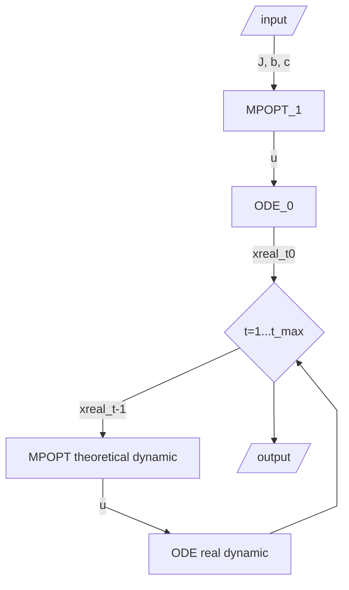

# General Information
This example provides an array of time dependent values of states computed by solving non-linear optimal control problems(OCP) in the standard Bolza form using pseudo-spectral collocation methods and adjusted using an additional real dynamic function. The OCP solver used in this example is MPOPT (based on IPOPT) library modified by Lulav Space team.

The dynamic function is:

$$ \dot{v_N} = f_N + \frac{v_N v_D}{R_L + h} - \tan \phi \frac{v_E^2}{R_L + h} 
$$ 

$$
\dot{v_E} = f_E + \frac{v_E v_D}{R_L + h} - \tan \phi \frac{v_E v_N}{R_L + h} 
$$
$$
\dot{v_D} = f_D + \frac{\mu_L}{{(R_L + h)}^2} - \tan \phi \frac{v_{horis}^2}{R_L + h}
\\
\text{where } v_{horis} = \sqrt{v_N^2 + v_E^2} \text{ is the magnitude of the horizontal velocity vector } V_{horis},
$$
$$
V_{horis}^L \triangleq {[v_N, v_e, 0]}^T,
$$
$$
\text{and where the latitude and altitude are determined from
} \\
\dot{\phi} = \frac{v_N}{R_L + h}, \quad \dot{h}=-v_D.
$$
$$
\text{The mass is} \\
$$
$$
\dot{m} = - \frac{F_{{thrust}}}{g_0 * I_{sp}}
$$
$$
\text{and the longitude is} \\
$$
$$
\dot{\lambda} = \frac{v_E}{(R_L + h)\cos{\phi}}
$$

You can define a "real" dynamic function to test the control values computed by solving non-linear optimal control problems(OCP). This function should have the same number of outputs. 

For this example terminal cost function, path constraints and terminal constraints functions used as well: 

1. Terminal contraints (we want to start from the given initial conditions and finish with the given final conditions):
$$
b_{min}^{(g)} \le b\big[x^{(1)}(t_0^{(1)}),...,x^{(P)}(t_0^{(P)}),t_0^{(1)},...,t_0^{(P)},x^{(1)}(t_f^{(1)}),...,x^{(P)}(t_f^{(1)}),...,t_f^{(P)},q^{(1)},...,q^{(P)},s \big] \le b_{max}^{(g)}
$$
$$
x(t_0) = x_0=[h_0, \phi_0, \lambda_0, v_{{N}_0},v_{{E}_0},v_{{D}_0}, m_{{fuel}_0}] \\
x(t_f) = x_f=[h_f, \phi_f, \lambda_f, v_{{N}_f},v_{{E}_f},v_{{D}_f}, m_{{fuel}_f}]
$$ 

2. Path constraints (we need to limit controls values within the maximum possible thrust):
$$
c_{min}^{(p)} \le c^{(p)} \Big[x^{(p)}, y^{(p)}, t^{(p)} \Big] \le c_{max}^{(p)},
$$

3. Cost function:
$$
J = \phi \big[x^{(1)}(t^{(1)}_0),..., x^{(P)}(t^{(P )}_0), t^{(1)}_0, . . . , t^{(P)}_0, x^{(1)}(t^{(1)}_f), . . . , x^{(P )}(t^{(P )}_f), t^{(1)}_f, . . . , t^{(P )}_f, q^{(1)}, . . . , q^{(P )}, s \big]
$$ 



# Installation
1. Clone the repository:
```bash 
git clone git@github.com:citros-garden/lunar_starship.git
```
2. Open folder in VSCode and reopen in Docker container


# Build
1. Build Ros2 packages:
```bash 
colcon build
```
2. Source the setup files:
```bash 
source install/local_setup.bash
```

# Run
1. Launch Ros2 node:
```bash 
ros2 launch lunar_starship launch.py
```

2. Open FoxGlove studio and select Rosbridge as a connection method, 
then select '/lunar_starship/state.data[index]' as an input for plot. In this case, 'index' is the index of state which data will be plotted.
OR use Ros2 listener node to receive data from '/lunar_starship/state' topic.
3. Data will be published after simulation finished
